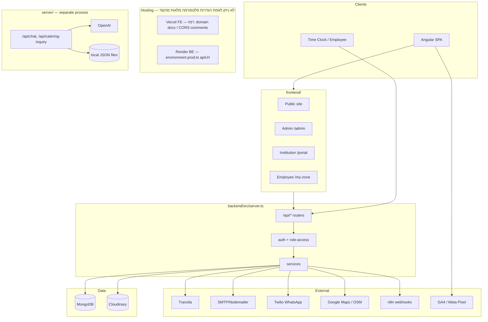

# 00 — System Overview

**מערכת:** מגדים (Megadim Catering)  
**תאריך מיפוי:** 2026-07-29  
**היקף:** קריאת קוד בלבד. אין חיבור ל־Production, אין כתיבה ל־DB, אין שליחת הודעות/חיובים.  
**הוכחות:** כל קביעה מלווה בנתיב קובץ.

---

## 1. מבנה המערכת

| רכיב | נתיב | תפקיד | סטטוס |
|------|------|--------|--------|
| Angular SPA | `frontend/` | אתר ציבורי, Admin, Portal מוסדי, Employee zone | **פעיל** — bootstrap מ־`frontend/src/main.ts` + `app.config.ts` |
| Express API (Mongo) | `backend/` | API ראשי: הזמנות, תשלום, CRM, מוסדות, מדיה | **פעיל** — `backend/src/server.ts` |
| Express AI/JSON mini | `server/` | Chat/OpenAI + summaries על קבצי JSON | **נפרד** — לא ממונט מ־`backend/`; פורט ברירת מחדל 8787 |
| Root orchestration | `package.json` | `concurrently` להרצת FE+BE | פעיל |
| Scripts / Seeds | `scripts/`, `seed.js`, `backend/seed.js`, `backend/scripts/` | Seed/מיגרציה/admin helpers | פעילים כסקריפטים ידניים |
| Docs | `docs/` | Audit + system-map | תיעוד |

---

## 2. טכנולוגיות וגרסאות

מתוך `package.json` של כל חבילה (גרסאות מוצהרות):

| שכבה | טכנולוגיה | גרסה מוצהרת | מקור |
|------|-----------|-------------|------|
| Frontend | Angular | `@angular/core` ^19.2.21 | `frontend/package.json` |
| Frontend | TypeScript | ~5.5.0 | `frontend/package.json` |
| Frontend | RxJS | ~7.8.0 | `frontend/package.json` |
| Backend | Express | ^4.22.1 | `backend/package.json` |
| Backend | Mongoose | ^9.1.1 | `backend/package.json` |
| Backend | TypeScript | ^5.2.2 | `backend/package.json` |
| Backend | Node engines | >=18, npm >=9 | `backend/package.json` `engines` |
| Server mini | Express + OpenAI | ללא version field בחבילה | `server/package.json` |
| CI | Node 20 | `.github/workflows/ci.yml` | |

---

## 3. נקודות כניסה

| תהליך | נקודת כניסה | הוכחה |
|--------|-------------|--------|
| Frontend dev | `ng serve` / `npm start` ב־`frontend/` | `frontend/package.json` scripts |
| Frontend bootstrap | `frontend/src/main.ts` → `AppComponent` + `routes` | imports `app.config.ts` |
| Backend dev | `ts-node-dev ... src/server.ts` | `backend/package.json` `dev` |
| Backend prod | `node dist/server.js` אחרי `tsc` | `backend/package.json` `start`/`build` |
| Backend unused alt | `backend/src/app.ts` | **לא מיובא** מ־`backend/src/server.ts` — Legacy/לא פעיל |
| Mini server | `node index.js` ב־`server/` | `server/package.json` |
| Root both | `npm start` → concurrently BE+FE | root `package.json` |
| Health | `GET /api/health` | `backend/src/server.ts` |

---

## 4. הקשר Angular ↔ Express ↔ MongoDB

```
Browser (Angular)
  └─ HttpClient + withCredentials (auth.interceptor.ts)
       └─ environment.apiUrl
            · dev:  http://localhost:4000/api
            · prod: https://magadim-backend.onrender.com/api
                 └─ Express (backend/src/server.ts)
                      └─ mongoose.connect(MONGO_URI)  [database.ts]
                           └─ Collections (Order, MenuItem, User, …)
```

- Session: JWT ב־HttpOnly cookie בשם `token` (`auth.routes.ts`) + אופציונלית Bearer (`middleware/auth.ts`).
- Production API URL קשיח ב־`frontend/src/environments/environment.prod.ts`.

---

## 5. תפקיד `backend/` מול `server/`

| | `backend/` | `server/` |
|--|-----------|-----------|
| Persistence | MongoDB | קבצי JSON מקומיים |
| Auth | JWT cookie/Bearer + roles | `X-Admin-Key` / `?key=` לסיכומים |
| Domain | הזמנות, תשלום Tranzila, CRM, מוסדות, מדיה | Chat + catering inquiry + summaries |
| Mounted by FE prod? | כן (`apiUrl` → Render) | **לא ניתן לאמת** האם ה־FE מצביע אליו ב־prod; צ׳אט קורא ל־`/api/chat` ו־`/api/agent` — `agent` קיים ב־backend; `chat` קיים ב־`server/` |

**ממצא:** `ChatWidgetComponent` קורא ל־`POST /chat` ביחס ל־`apiUrl` — ב־backend הפעיל **אין** `/api/chat`; יש `/api/agent`. לכן צ׳אט דרך `apiUrl` של backend עלול להיות שבור אלא אם reverse-proxy מפנה ל־`server/`. מסומן: **לא ניתן לאמת ב־runtime**.

---

## 6. פעיל מול Legacy / לא מחובר

| פריט | סטטוס | הוכחה |
|------|--------|--------|
| `backend/src/server.ts` mounts | פעיל | שורות 219–245 |
| `backend/src/app.ts` | לא מחובר | אין import מ־entrypoint |
| `backend/src/routes/auth.js`, `menu.js` | לא ממונטים | לא ב־`backend/src/server.ts` |
| `frontend/src/app/admin-app.routes.ts` | לא בשימוש ב־bootstrap | `app.config.ts` משתמש ב־`routes` מ־`app.routes.ts` |
| `Product.js` model | אין writers ב־controllers | grep — רק schema |
| DTO `*.model.ts` (order/user/…) | Type-only | אין `mongoose.model` |
| Testimonials JSON file | פעיל דרך routes | לא Mongo `testimonial.model.ts` |
| Menu auto-reseed ב־GET | פעיל (מסוכן) | `menu.controller.ts` `countDocuments() < 5` |

---

## 7. תרשים ארכיטקטורה (Mermaid)



---

## 8. תהליכים שיש להפעיל כדי שהמערכת תעבוד

| # | תהליך | פקודה / הערות |
|---|--------|----------------|
| 1 | MongoDB זמין | `MONGO_URI` ב־`backend/.env` — **לא ניתן לאמת** hosting |
| 2 | Backend | `cd backend && npm run dev` או `npm start` אחרי build |
| 3 | Frontend | `cd frontend && npm start` |
| 4 | (אופציונלי) Mini AI server | `cd server && npm run dev` — רק אם צ׳אט/summaries נדרשים |
| 5 | משתני סביבה קריטיים | ראו `07_DEPLOYMENT_AND_RUNTIME.md` — שמות בלבד |
| 6 | Seed ראשוני | `npm run seed` / `backend` seed — ידני |
| 7 | CI | GitHub Actions בונה FE בלבד — לא מריץ BE |

**ספירות מיפוי (לאחר אימות 2026-07-30):** Frontend URL-bearing routes=105; Backend Endpoints=162; `server/` Endpoints=6; Models persisted=23; Sensitive auth-matrix rows=142; Business flows=20.

