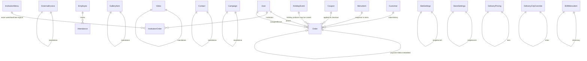

# 03 — Database Map

**ORM:** Mongoose (`backend/package.json`, mongoose `^9.1.1`)  
**Connection:** `backend/src/config/database.ts`; `MONGO_URI` is required. No URI or secret value is reproduced here.  
**Persisted model count:** **23** = 22 files in `backend/src/models` that call `mongoose.model(...)` + inline `TestConnection`.  
**Type-only files (no model/collection):** `order.model.ts`, `user.model.ts`, `contact.model.ts`, `menuItem.model.ts`, `gallery.model.ts`, `video.model.ts`, `testimonial.model.ts`. Testimonials use a JSON file at runtime, not MongoDB.

## Reading conventions

- Every root schema has implicit `_id: ObjectId` and `__v: Number` unless stated otherwise.
- `timestamps: true` adds `createdAt: Date` and `updatedAt: Date`; the InstitutionMenu timestamp option adds only `updatedAt`.
- A property not marked `required` is optional. “No explicit default” means the schema does not declare one.
- Mongoose document arrays have an implicit `[]` default unless explicitly overridden. This is called out for every array.
- Embedded schemas with `{ _id: false }` have no `_id`; HolidayEvent products intentionally have `_id: ObjectId`.
- `unique`, `sparse`, and `index` describe indexes, not validators.
- Schema `strict` defaults to `true`; only `Order` states it explicitly and `SiteSettings` explicitly uses `false`.
- Unless listed, a model has no hooks, virtuals, methods, statics, field indexes, schema indexes, refs, `select`, or custom collection option.

## Inventory

| # | Model | Collection | Exact schema source |
|---|---|---|---|
| 1 | Order | `orders` | `backend/src/models/Order.ts:97-229` |
| 2 | Customer | `customers` | `backend/src/models/Customer.ts:27-112` |
| 3 | User | `users` | `backend/src/models/User.js:4-114` |
| 4 | Employee | `employees` | `backend/src/models/Employee.js:4-57` |
| 5 | Attendance | `attendances` | `backend/src/models/Attendance.js:4-48` |
| 6 | InstitutionOrder | `institutionorders` | `backend/src/models/InstitutionOrder.ts:13-114` |
| 7 | InstitutionMenu | `institutionmenus` | `backend/src/models/InstitutionMenu.ts:12-119` |
| 8 | ExternalInvoice | `external_invoices` | `backend/src/models/ExternalInvoice.ts:13-35` |
| 9 | MenuItem | `menuitems` | `backend/src/models/menuItem.ts:4-207` |
| 10 | Product | `products` | `backend/src/models/Product.js:4-174` |
| 11 | B2BMenuItem | `b2bmenuitems` | `backend/src/models/B2BMenuItem.ts:30-68` |
| 12 | HolidayEvent | `holidayEvents` | `backend/src/models/holidayEvent.model.ts:36-86` |
| 13 | Coupon | `coupons` | `backend/src/models/coupon.model.ts:21-87` |
| 14 | DeliveryPricing | `delivery_pricing` | `backend/src/models/delivery-pricing.model.ts:16-63` |
| 15 | DeliveryCityOverride | `delivery_city_overrides` | `backend/src/models/delivery-city-override.model.ts:12-30` |
| 16 | StoreSettings | `store_settings` | `backend/src/models/store-settings.model.ts:7-43` |
| 17 | SiteSettings | `site_settings` | `backend/src/models/siteSettings.model.ts:15-99` |
| 18 | Setting | `settings` | `backend/src/models/setting.model.ts:15-25` |
| 19 | Contact | `contacts` | `backend/src/models/Contact.ts:38-117` |
| 20 | Campaign | `campaigns` | `backend/src/models/Campaign.ts:18-47` |
| 21 | Video | `videos` | `backend/src/models/Video.js:3-58` |
| 22 | GalleryItem | `galleryitems` | `backend/src/models/GalleryItem.js:3-41` |
| 23 | TestConnection | `test_connections` | `backend/src/config/database.ts:13-27` |

---

## 1. Order

Source: `backend/src/models/Order.ts:97-229`.

### Fields

- `_id: ObjectId` — implicit; `__v: Number` — implicit.
- `userId: ObjectId | null` — ref `User`; `required: false`; default `null`; field index plus schema index `{ userId: 1 }`.
- `orderNumber: String` — no explicit default; `unique: true`, `sparse: true`, `index: true`.
- `customerDetails: Object` — required; unconstrained object value. Nested keys are **not schema-defined**, despite service/controller code storing snapshots such as names, phone, address, event/order dates, notes, shipping information and coupon information.
- `items: Array<embedded document>` — not required; implicit default `[]`; each element has implicit `_id: ObjectId` because no `{ _id: false }` is set:
  - `items[].productId: String`
  - `items[].name: String`
  - `items[].price: Number`
  - `items[].quantity: Number`
  - `items[].category: String`
  - `items[].selectedOption: embedded object`
    - `items[].selectedOption.label: String`
    - `items[].selectedOption.amount: String`
    - `items[].selectedOption.price: Number`
  - `items[].imageUrl: String`
  - `items[].description: String`
  - None of the item or selected-option fields is required and none has an explicit default or validator.
- `totalPrice: Number` — required.
- `status: String` — enum `pending | processing | ready | cancelled | new | in-progress | out_for_delivery | delivery_failed | delivered`; default `'pending'`.
- `isDeleted: Boolean` — default `false`; field index.
- `orderType: String` — enum `shabbat | catering`; `required: false`; schema index `{ orderType: 1 }`.
- `numberOfPortions: Mixed` — `required: false`.
- `portionsEvening: Number` — `required: false`; min `0`.
- `portionsMorning: Number` — `required: false`; min `0`.
- `mealTime: String` — `required: false`.
- `mealTypes: String` — `required: false`.
- `subtotal: Number | null` — default `null`.
- `deliveryFee: Number | null` — default `null`.
- `cateringKind: String` — enum `shabbat | events`; `required: false`; field index.
- `eventType: String` — `required: false`.
- `guestCount: Number` — `required: false`.
- `venue: String` — `required: false`.
- `marketingData: embedded object` — no explicit parent default:
  - `marketingData.utm_source: String` — trim.
  - `marketingData.utm_medium: String` — trim.
  - `marketingData.utm_campaign: String` — trim.
  - `marketingData.utm_term: String` — trim.
  - `marketingData.utm_content: String` — trim.
- `assignedDriverId: ObjectId | null` — ref `User`; default `null`; field index.
- `assignedDriverName: String` — trim; default `''`.
- `assignedAt: Date | null` — default `null`.
- `paymentStatus: String` — enum `pending | awaiting_payment | authorized | captured | voided | failed`; default `'pending'`; field index.
- `authCode: String` — `required: false`; trim; `select: false`.
- `transactionId: String` — `required: false`; trim.
- `cardToken: String` — `required: false`; trim; `select: false`.
- `expireMonth: Number` — `required: false`; `select: false`.
- `expireYear: Number` — `required: false`; `select: false`.
- `authorizedAmount: Number | null` — `required: false`; default `null`.
- `adminNotes: String` — trim; default `''`; maxlength `1000`.
- `salads: String[]` — each string trimmed; implicit default `[]`.
- `firstCourses: String[]` — each string trimmed; implicit default `[]`.
- `mainCourses: String[]` — each string trimmed; implicit default `[]`.
- `firstCoursesEvening: String[]` — each string trimmed; implicit default `[]`.
- `firstCoursesMorning: String[]` — each string trimmed; implicit default `[]`.
- `mainCoursesEvening: String[]` — each string trimmed; implicit default `[]`.
- `mainCoursesMorning: String[]` — each string trimmed; implicit default `[]`.
- `sidesEvening: String[]` — each string trimmed; implicit default `[]`.
- `sidesMorning: String[]` — each string trimmed; implicit default `[]`.
- `paymentSecurityToken: String` — `required: false`; `select: false`.
- `confirmationEmailSentAt: Date | null` — `required: false`; default `null`.
- `createdAt: Date`, `updatedAt: Date` — timestamps.

Options: `{ timestamps: true, collection: 'orders', strict: true }`.

Indexes: field indexes above, plus `{ userId: 1 }`, `{ status: 1, createdAt: -1 }`, `{ createdAt: -1 }`, `{ orderType: 1 }`. No hooks, virtuals, methods, or statics.

Reads/writes:

- `/api/order` and `/api/orders` routes call `order.controller.ts`/`order.service.ts`: checkout/create writes the order snapshot and the schema-defined cart/catering, totals, marketing and status fields; list/detail/search/dashboard/kitchen/delivery endpoints read them.
- `PUT|PATCH /api/order/:id/status` changes `status`; `PATCH /:id/date` changes the date nested in `customerDetails`; `PATCH /:id/assign-driver` changes `assignedDriverId`, `assignedDriverName`, `assignedAt`; admin item/portion/note/shipping endpoints replace `items`, recompute `totalPrice`/`subtotal`/`deliveryFee`, change portion arrays/counts or `adminNotes`; delete/restore changes `isDeleted`; permanent delete removes the document (`backend/src/routes/order.routes.ts:89-145`, `backend/src/services/order.service.ts:625-1112`).
- `/api/catering` creates Shabbat/event orders and writes `orderType`, `cateringKind`, `customerDetails`, portions/course arrays, `eventType`, `guestCount`, `venue`, totals and marketing fields (`backend/src/controllers/catering.controller.ts`).
- `/api/payment` reads the order and changes `paymentStatus`, `authCode`, `transactionId`, `cardToken`, `expireMonth`, `expireYear`, `authorizedAmount`, `paymentSecurityToken`; successful confirmation flow can set `confirmationEmailSentAt` (`backend/src/controllers/payment.controller.ts`, `backend/src/services/email.service.ts`).
- `/api/admin/accounting/summary|transactions` reads `paymentStatus`, `isDeleted`, `totalPrice`, `createdAt`, `customerDetails` (`backend/src/controllers/accounting.controller.ts:32-203`).
- `customer.service.ts` and `coupon.service.ts` use completed order data for customer totals/history and coupon accounting.

---

## 2. Customer

Source: `backend/src/models/Customer.ts:27-112`.

Fields:

- `_id: ObjectId`, `__v: Number` — implicit.
- `normalizedPhone: String` — required; unique; trim.
- `fullName: String` — trim.
- `email: String` — trim; lowercase.
- `address: String` — trim; default `''`.
- `city: String` — trim; default `''`; field index.
- `totalSpent: Number` — default `0`.
- `orderCount: Number` — default `0`.
- `lastOrderDate: Date | null` — default `null`.
- `orderHistory: ObjectId[]` — elements ref `Order`; explicit default `[]`.
- `manualStatus: String` — enum `NONE | VIP | BLACKLIST`; default `'NONE'`; field index.
- `customerCategory: String` — enum `all | returning | sleeping | vip | registered`; default `'all'`; field index.
- `tags: String[]` — explicit default `[]`.
- `adminNotes: String` — default `''`.
- `dietaryInfo: String` — default `''`.
- `isRegistered: Boolean` — default `false`; field index.
- `createdAt: Date`, `updatedAt: Date` — timestamps.

Options: timestamps, collection `customers`, default strict. Indexes: unique `normalizedPhone`; field indexes above; `{ manualStatus: 1, updatedAt: -1 }`; `{ customerCategory: 1, updatedAt: -1 }`. No hooks/virtuals/methods/statics.

Reads/writes:

- Order/customer synchronization in `customer.service.ts` upserts identity/address fields and changes `totalSpent`, `orderCount`, `lastOrderDate`, `orderHistory`, derived category/registration state.
- `/api/customers` list/create/migrate/audit/CRM/delete reads all customer fields; CRM update changes `manualStatus`, `customerCategory`, `tags`, `adminNotes`, `dietaryInfo`; delete removes the document (`backend/src/routes/customer.routes.ts:15-20`, `backend/src/controllers/customer.controller.ts`).
- `/api/auth/register` marks matching customers `isRegistered: true` (`backend/src/routes/auth.routes.ts:60-62`).
- Coupon validation reads phone/category/status and order history through `coupon.service.ts`.

---

## 3. User

Source: `backend/src/models/User.js:4-114`.

Fields:

- `_id: ObjectId`, `__v: Number` — implicit.
- `username: String` — required; unique; trim; lowercase.
- `password: String` — required. It is selected by default at schema level; API code commonly excludes it explicitly.
- `fullName: String` — required; trim.
- `role: String` — enum `admin | user | driver | institution`; default `'user'`; field index.
- `phone: String` — trim.
- `address: String` — trim; default `''`.
- `isActive: Boolean` — default `true`.
- `tags: String[]` — explicit default `[]`.
- `adminNotes: String` — default `''`.
- `dietaryInfo: String` — default `''`.
- `deletedAt: Date | null` — default `null`; field index.
- `portalSettings: embedded object`:
  - `portalSettings.deadlineDay: Number` — min `0`, max `6`, default `4`.
  - `portalSettings.deadlineTime: String` — trim; default `'12:00'`.
  - `portalSettings.customMessage: String` — trim; default `''`.
- `createdAt: Date`, `updatedAt: Date` — timestamps.

Options: timestamps, collection `users`, default strict. Indexes: unique `username`, `role`, `deletedAt`.

Hook: pre-`save` hashes `password` with bcrypt cost 10 only when the path is modified (`User.js:80-96`).  
Methods: `comparePassword(candidatePassword)` performs bcrypt comparison; custom `toJSON()` deletes `password` (`User.js:98-112`). No virtuals/statics.

Reads/writes:

- `/api/auth/login|register|validate|me` reads username/password/account state; registration writes `username`, `password`, `fullName`, `role`, phone/profile defaults (`auth.routes.ts`, `auth.js`).
- `/api/admin/institutions` creates/updates institution users and their `portalSettings`; delete is soft and sets `isActive: false`, `deletedAt: now` (`institution.controller.ts:46-195`).
- `/api/users/resolve|drivers|:id/role|:id/crm` reads users and changes `role`, `tags`, `adminNotes`, `dietaryInfo` (`user.controller.ts`).
- Portal/order middleware reads `_id`, `role`, `isActive`, institution identity and driver identity. InstitutionOrder and Order reference this model.

---

## 4. Employee

Source: `backend/src/models/Employee.js:4-57`.

Fields:

- `_id: ObjectId`, `__v: Number` — implicit.
- `firstName: String` — required; trim.
- `lastName: String` — required; trim.
- `role: String` — required; trim; enum `Chef | Driver | Cleaner | Manager | Other`.
- `phone: String` — required; trim.
- `hourlyRate: Number` — required; min `0`.
- `isActive: Boolean` — default `true`.
- `pinCode: String` — required; trim; minlength `4`; maxlength `6`; stored as plaintext by this schema.
- `createdAt: Date`, `updatedAt: Date` — timestamps.

Options: timestamps, collection `employees`. Indexes: `{ isActive: 1 }`, `{ role: 1 }`.

Virtual: `fullName` returns `` `${firstName} ${lastName}` ``. No hooks/methods/statics.

Reads/writes: `/api/employees` CRUD uses `employee.service.ts`; create/update accepts employee fields, delete sets only `isActive: false`, list/stats read identity, role, phone, rate, PIN and Attendance state (`employee.service.ts:20-239`). `/api/auth/employee-login` reads `phone`, `pinCode`, `isActive`. Attendance services read employee identity/rate and active state.

---

## 5. Attendance

Source: `backend/src/models/Attendance.js:4-48`.

Fields:

- `_id: ObjectId`, `__v: Number` — implicit.
- `employeeId: ObjectId` — ref `Employee`; required; field index.
- `clockIn: Date` — required; default `Date.now`.
- `clockOut: Date` — `required: false`.
- `status: String` — enum `active | completed`; default `'active'`.
- `totalHours: Number` — `required: false`; min `0`.
- `createdAt: Date`, `updatedAt: Date` — timestamps.

Options: timestamps, collection `attendances`. Indexes: field `employeeId`; `{ employeeId: 1, status: 1 }`; `{ clockIn: -1 }`.

Hook: pre-`save`, when both timestamps exist, sets `totalHours` to `(clockOut-clockIn)` in hours rounded to 2 decimals (`Attendance.js:39-45`).

Reads/writes: `/api/attendance/clock|clock-in` creates `{ employeeId, clockIn: now, status: active }`; clock-out changes `clockOut`, `status: completed`, and `totalHours`; history/active/report read all shift fields and populate employee identity/rate (`attendance.service.ts:4-228`). Employee list/stats also read active/completed attendance.

---

## 6. InstitutionOrder

Source: `backend/src/models/InstitutionOrder.ts:13-114`; exact default object helper: `backend/src/utils/menu-structure.ts:185-202`.

Fields:

- `_id: ObjectId`, `__v: Number` — implicit.
- `institutionId: ObjectId` — ref `User`; required; field index.
- `weekStartDate: String` — required; match `/^\d{4}-\d{2}-\d{2}$/`; field index.
- `isLocked: Boolean` — default `false`.
- `days: Array<InstitutionOrderDay>` — explicit default `[]`; child `_id: false`:
  - `days[].dayOfWeek: Number` — required; min `0`; max `4`.
  - `days[].regularCount: Number` — default `0`; min `0`.
  - `days[].vegetarianCount: Number` — default `0`; min `0`.
  - `days[].notes: String` — trim; default `''`.
- `shabbatOrder: embedded ShabbatOrder` — child `_id: false`; default function `() => emptyShabbatOrder()`, exactly `{ regularCount: 0, vegetarianCount: 0, wantsSeudaShlishit: false, extras: { challahs: 0, rolls: 0, grapeJuice: 0 } }`:
  - `shabbatOrder.regularCount: Number` — default `0`; min `0`.
  - `shabbatOrder.vegetarianCount: Number` — default `0`; min `0`.
  - `shabbatOrder.wantsSeudaShlishit: Boolean` — default `false`.
  - `shabbatOrder.extras: embedded object` — `_id: false`; default function returning the helper’s `extras`:
    - `shabbatOrder.extras.challahs: Number` — default `0`; min `0`.
    - `shabbatOrder.extras.rolls: Number` — default `0`; min `0`.
    - `shabbatOrder.extras.grapeJuice: Number` — default `0`; min `0`.
  - `shabbatOrder.mealPortions: embedded object` — `_id: false`; `required: false`:
    - `shabbatOrder.mealPortions.fridayNight: embedded counts` — default function returning `{ regularCount: 0, vegetarianCount: 0 }`; `_id: false`.
      - `.regularCount: Number` — default `0`; min `0`.
      - `.vegetarianCount: Number` — default `0`; min `0`.
    - `shabbatOrder.mealPortions.shabbatDay: embedded counts` — same exact default and fields.
    - `shabbatOrder.mealPortions.seudaShlishit: embedded counts` — `required: false`; no parent default.
      - `.regularCount: Number` — default `0`; min `0`.
      - `.vegetarianCount: Number` — default `0`; min `0`.
  - `shabbatOrder.notes: String` — trim; default `''`; maxlength `1000`.
- `generalNotes: String` — trim; default `''`; maxlength `1000`.
- `adminNotes: String` — trim; default `''`; maxlength `1000`.
- `createdAt: Date`, `updatedAt: Date` — timestamps.

Options: timestamps, collection `institutionorders`. Unique compound index `{ institutionId: 1, weekStartDate: 1 }`. No hooks/virtuals/methods/statics.

Reads/writes: `/api/portal/status|submit` reads menu/order/user state and upserts the submitting institution’s `days`, `shabbatOrder`, `generalNotes`, lock state and week key. `/api/admin/institutions/reports|order/:institutionId` reads; admin update upserts normalized `days`, `shabbatOrder`, `generalNotes`, `adminNotes`, `isLocked`; delete removes the institution/week document. Legacy date-valued week keys are migrated to the string key (`institution-admin.controller.ts:191-236,399-526`).

---

## 7. InstitutionMenu

Source: `backend/src/models/InstitutionMenu.ts:12-119`; defaults/constants: `backend/src/utils/menu-structure.ts:19,130-157`.

Fields:

- `_id: ObjectId`, `__v: Number` — implicit.
- `weekStartDate: String` — required; match `/^\d{4}-\d{2}-\d{2}$/`; unique; field index.
- `sunday`, `monday`, `tuesday`, `wednesday`, `thursday`: each is an embedded `MenuDayItems`, `_id: false`, default function returning the following exact object:
  - `.mainMeat: String` — trim; default `''`.
  - `.vegetarianMain: String` — trim; default `''`.
  - `.carb1: String` — trim; default `''`.
  - `.carb2: String` — trim; default `''`.
  - `.side: String` — trim; default `''`.
  - `.saladFruit: String` — trim; default `''`.
- `shabbatPackage: embedded object` — `_id: false`; default function returning the full object below:
  - `shabbatPackage.hasShabbat: Boolean` — default `true`.
  - `shabbatPackage.fridayNight: embedded object` — default function returns all fields as `''`; `_id: false`:
    - `.fish`, `.mainMeat`, `.vegetarianMain`, `.carb1`, `.carb2`, `.side`: each `String`, trim, default `''`.
  - `shabbatPackage.shabbatDay: embedded object` — default function returns all fields as `''`; `_id: false`:
    - `.mainMeat`, `.vegetarianMain`, `.carb1`, `.carb2`, `.side`: each `String`, trim, default `''`.
  - `shabbatPackage.seudaShlishit: embedded object` — default function returns `{ carb: '', protein: '' }`; `_id: false`:
    - `.carb: String` — trim; default `''`.
    - `.protein: String` — trim; default `''`.
  - `shabbatPackage.shabbatSalads: String[]` — explicit function default `() => ['', '', '', '', '', '']`; custom validator requires an array of exactly `SHABBAT_SALAD_SLOTS` (`6`) entries; message `shabbatSalads must contain exactly 6 entries`.
- `orderDeadline: Date` — required.
- `weekdayOrderDeadline: Date` — `required: false`.
- `shabbatOrderDeadline: Date` — `required: false`.
- `updatedAt: Date` — timestamp; no `createdAt`.

Options: `{ timestamps: { createdAt: false, updatedAt: true }, collection: 'institutionmenus' }`. Index: unique `weekStartDate`. No hooks/virtuals/methods/statics.

Reads/writes: `/api/admin/institutions/menu` reads/upserts/deletes the weekly menu. Upsert changes the week key, all five complete day blocks, complete `shabbatPackage`, and deadline fields; duplicate/legacy week documents are purged or migrated (`institution-admin.controller.ts:120-187`). Portal status and institution reports read menu content/deadlines.

---

## 8. ExternalInvoice

Source: `backend/src/models/ExternalInvoice.ts:13-35`.

Fields: `_id`, `__v`; `invoiceNumber: String` trim; `clientName: String` required trim; `amount: Number` required; `issueDate: Date` required default `Date.now`; `description: String` trim; `fileUrl: String` trim; `fileKey: String` trim; timestamp `createdAt`, `updatedAt`.

Options: timestamps, collection `external_invoices`. Indexes `{ issueDate: -1 }`, `{ clientName: 1 }`.

Reads/writes: `/api/admin/accounting/summary|transactions` aggregates/reads amount, issue date and display/file fields. `POST /external` writes all schema fields (issueDate defaults to current time in controller if omitted); `/upload` only returns upload metadata and does not itself persist (`accounting.controller.ts:32-247`).

---

## 9. MenuItem

Source: `backend/src/models/menuItem.ts:4-207`.

Fields:

- `_id`, `__v`.
- `name: String` — required; trim; field index.
- `category: String` — required; trim.
- `description: String` — trim.
- `price: Number` — `required: false`; min `0`.
- `pricePer100g: Number` — `required: false`; min `0`.
- `pricingVariants: Array<PriceVariant>` — `required: false`; explicit default `undefined` (suppresses the normal array `[]` default); child `_id: false`:
  - `size: String` required trim.
  - `label: String` required trim.
  - `price: Number` required min `0`.
  - `weight: Number` `required: false`, min `0`.
- `pricingOptions: Array<PricingOption>` — `required: false`; explicit default `undefined`; child `_id: false`:
  - `label: String` required trim.
  - `price: Number` required min `0`.
  - `amount: String` required trim.
- `imageUrl: String` — trim.
- `tags: String[]` — explicit default `[]`.
- `isAvailable: Boolean` — default `true`.
- `isPopular: Boolean` — default `false`.
- `isFeatured: Boolean` — default `false`.
- `order: Number` — default `0`.
- `servingSize: String` — trim.
- `recipe: Array<RecipeIngredient>` — `required: false`; explicit default `[]`; child `_id: false`:
  - `name: String` required trim.
  - `quantity: Number` required min `0`.
  - `unit: String` required trim.
  - `category: String` required trim.
- `createdAt`, `updatedAt` timestamps.

Options: timestamps, collection `menuitems`. Indexes: field `name`; `{ category: 1 }`; `{ isPopular: 1 }`; text `{ name: 'text' }`.

Hook: pre-`save` rejects a document unless at least one of `price`, a non-empty `pricingVariants`, or a non-empty `pricingOptions` exists (`menuItem.ts:185-197`). This hook does not run for raw update queries unless code explicitly causes save middleware.

Reads/writes: `/api/menu` public/admin endpoints list/filter/read and create/update/delete all schema fields; reorder changes `order`; migration changes category/availability where applicable (`menu.controller.ts`, `routes/menu.routes.ts:19-32`; legacy `routes/menu.js`). `order.service.ts` reads authoritative names/prices/options/images during checkout; `shopping.service.ts` reads recipes. Startup Cholent seed inserts complete menu items only when marker data is absent. Shavuot migration reads source items and can archive them.

---

## 10. Product (legacy)

Source: `backend/src/models/Product.js:4-174`.

Fields:

- `_id`, `__v`.
- `name: String` required trim field index.
- `category: String` required trim field index.
- `description: String` required trim.
- `price: Number` `required: false`, min `0`.
- `pricingVariants: Array<PriceVariant>` — `required: false`; default `undefined`; child `_id: false`:
  - `size: String` required trim; `label: String` required trim; `price: Number` required min `0`; `weight: Number` optional min `0`.
- `imageUrl: String` required trim.
- `tags: String[]` — `required: false`; default `[]`.
- `isAvailable: Boolean` — `required: false`; default `true`; field index.
- `isPopular: Boolean` — `required: false`; default `false`; field index.
- `servingSize: String` — `required: false`; trim.
- `ingredients: String[]` — `required: false`; default `[]`.
- `allergens: String[]` — `required: false`; default `[]`.
- `nutritionInfo: embedded object` — `required: false`; child `_id: false`:
  - `calories`, `protein`, `carbs`, `fat`: each `Number`, `required: false`, min `0`.
- `createdAt`, `updatedAt` timestamps.

Options: timestamps, collection `products`. Indexes: fields `name`, `category`, `isAvailable`, `isPopular`; compounds `{ category: 1, isAvailable: 1 }`, `{ isPopular: 1, isAvailable: 1 }`; text `{ name: 'text', description: 'text' }`.

Hook: pre-`validate` requires `price` or non-empty `pricingVariants`. Method `getEffectivePrice()` returns fixed price, otherwise first variant price, otherwise `null`. Statics: `findAvailable()`, `findPopular(limit=6)`, `findByCategory(category)`.

Runtime usage: no active route/controller/service imports this model. It remains a persisted-capable legacy model, not a type-only file.

---

## 11. B2BMenuItem

Source: `backend/src/models/B2BMenuItem.ts:30-68`; enum constants: `backend/src/utils/b2b-calculation-settings.ts:1-24`.

Fields:

- `_id`, `__v`.
- `name: String` — required; trim.
- `category: String` — required; enum `mainMeat | vegetarianMain | carb | side | saladFruit | fish`.
- `gramsPerPortion: Number` — default `200`; min `1`.
- `portionsPerGastronorm: Number` — default `40`; min `1`.
- `calculationSettings: embedded object` — `required: false`; child `_id: false`:
  - `enabled: Boolean` — default `false`.
  - `reportUnit: String` — enum `portion | unit | kg | gram | liter | ml | tray | pan | box | package`.
  - `calculationMethod: String` — enum `per_portion | fixed_per_order | per_x_portions | manual`.
  - `quantityPerPortion: Number` — min `0`.
  - `quantityPerOrder: Number` — min `0`.
  - `quantityPerXPortions: Number` — min `0`.
  - `xPortions: Number` — min `0`.
  - `rounding: String` — enum `none | ceil | floor | round`; default `'none'`.
  - `minimumQuantity: Number` — min `0`.
  - No nested field is schema-required. Controller parsing conditionally requires positive quantity fields according to `calculationMethod`; those are service/controller rules, not Mongoose `required` functions.
- `isActive: Boolean` — default `true`; field index.
- `createdAt`, `updatedAt`.

Options: timestamps, collection `b2bmenuitems`. Unique compound `{ category: 1, name: 1 }`.

Reads/writes: `/api/admin/b2b-dictionary` lists. POST/PUT writes normalized `name`, `category`, category-dependent grams/GN values, `isActive: true`, and either the complete enabled `calculationSettings` or unsets it; DELETE soft-deletes by setting `isActive: false` (`b2b-dictionary.controller.ts:53-204`). Institution reports read this dictionary for calculations.

---

## 12. HolidayEvent

Source: `backend/src/models/holidayEvent.model.ts:36-86`.

Fields:

- `_id`, `__v`.
- `name: String` — required; trim.
- `isActive: Boolean` — default `false`.
- `orderDeadline: Date` — required.
- `imageUrl: String` — default `''`; trim.
- `products: Array<HolidayEventProduct>` — explicit default `[]`; each product has `_id: ObjectId`:
  - `products[].title: String` — required; trim.
  - `products[].price: Number` — default `0`; min `0`.
  - `products[].description: String` — default `''`; trim.
  - `products[].imageUrl: String` — default `''`; trim.
  - `products[].isAvailable: Boolean` — default `true`.
  - `products[].pricingType: String` — enum `fixed | variants`; default `'fixed'`.
  - `products[].weightUnit: String` — enum `unit | 100g`; default `'unit'`.
  - `products[].pricingOptions: Array<HolidayPricingOption>` — explicit default `[]`; child `_id: false`:
    - `label: String` required trim.
    - `amount: String` required trim.
    - `price: Number` required min `0`.
- `createdAt`, `updatedAt`.

Options: timestamps, collection exactly `holidayEvents`. Index `{ isActive: 1, orderDeadline: 1 }`. No hooks/virtuals/methods/statics. Model registration deliberately deletes an existing in-process `mongoose.models.HolidayEvent` before recompiling; this does not delete database data.

Reads/writes: public active and admin list/detail endpoints read event/product fields. POST/PUT writes `name`, `isActive`, `orderDeadline`, `imageUrl`, and a fully normalized products/options array; activating one event sets `isActive: false` on all others. DELETE removes it. Shavuot migration creates an event/products from MenuItem and may change source availability (`holiday-event.controller.ts:165-331`, `shavuot-migration.service.ts`). Checkout utility reads an event/product snapshot by IDs.

---

## 13. Coupon

Source: `backend/src/models/coupon.model.ts:21-87`.

Fields: `_id`, `__v`; `code: String` required unique uppercase trim; `discountType: String` required enum `percentage | fixedAmount`; `discountValue: Number` required; `minOrderValue: Number` default `0`; `expiresAt: Date | null` default `null`; `maxUses: Number | null` default `null`; `maxUsesPerCustomer: Number` default `1`; `usageCount: Number` default `0`; `usedByPhones: String[]` default `[]`; `isActive: Boolean` default `true`; `totalRevenueGenerated: Number` default `0`; `isVipOnly: Boolean` default `false`; `targetCustomerCategory: String` enum `all | returning | sleeping | vip | new`, default `'all'`; timestamps.

Options: timestamps, collection `coupons`. Indexes: unique `code`; `{ isActive: 1, expiresAt: 1 }`; `{ usedByPhones: 1 }`.

Reads/writes: `/api/coupons` CRUD reads/writes all administrative fields. Controller additionally enforces non-negative discount/minimum, percentage ≤100, max-use constraints and valid dates; these are not schema validators. `/apply` only validates/reads; coupon consumption in order flow changes `usageCount`, pushes normalized phone to `usedByPhones`, and increments `totalRevenueGenerated` through `coupon.service.ts` (`coupon.controller.ts:14-205`).

---

## 14. DeliveryPricing

Source: `backend/src/models/delivery-pricing.model.ts:16-63`.

Fields:

- `_id`, `__v`.
- `minDistanceKm: Number` — required; min `[0, 'minDistanceKm must be a non-negative number']`; custom `Number.isFinite`, message `minDistanceKm must be a valid number`.
- `maxDistanceKm: Number` — required; same min/finite checks with max-field messages; additional document validator requires `maxDistanceKm >= minDistanceKm`.
- `price: Number` — required; min `[0, 'price must be a non-negative number']`; custom `Number.isFinite`, message `price must be a valid number`.
- `freeShippingThreshold: Number | null` — `required: false`; default `null`.
- `minOrderForDelivery: Number | null` — `required: false`; default `null`.
- `isActive: Boolean` — default `true`.
- timestamps.

Options: timestamps, collection `delivery_pricing`. Indexes `{ minDistanceKm: 1, maxDistanceKm: 1 }`, `{ isActive: 1 }`.

Reads/writes: delivery calculation and `/api/delivery/pricing` read active tiers and all pricing/threshold fields. `PUT /api/settings/delivery` transactionally replaces the entire collection with normalized tiers. Startup seed inserts defaults only if collection count is zero; explicit seed function can replace all tiers (`settings.controller.ts:328-491`, `delivery.service.ts:192-306`, `seed/deliveryPricingSeed.ts`).

---

## 15. DeliveryCityOverride

Source: `backend/src/models/delivery-city-override.model.ts:12-30`.

Fields: `_id`, `__v`; `cityName: String` required trim; `displayName: String` required trim; `overridePrice: Number` required; `isActive: Boolean` default `true`; timestamps.

Options: timestamps, collection `delivery_city_overrides`. Indexes `{ cityName: 1 }` (not unique), `{ isActive: 1 }`.

Reads/writes: delivery fee service reads active override by normalized `cityName`. `/api/delivery/cities` lists; POST writes all four fields; PUT changes `displayName`, normalized `cityName`, `overridePrice`, `isActive` when supplied; DELETE removes (`delivery.controller.ts:180-253`).

---

## 16. StoreSettings

Source: `backend/src/models/store-settings.model.ts:7-43`.

Fields:

- `_id`, `__v`.
- `freeShippingThreshold: Number` — default `500`.
- `isFreeShippingActive: Boolean` — default `false`.
- `baseDeliveryFee: Number` — default `25`.
- `pricePerKm: Number` — default `3`.
- `openDates: String[]` — explicit default `[]`; no schema regex on individual strings.
- `openDateRules: Array<embedded document>` — explicit default `[]`; child documents have implicit `_id: ObjectId`:
  - `openDateRules[].date: String` — required; match `/^\d{4}-\d{2}-\d{2}$/`.
  - `openDateRules[].cutoffTime: String` — required; default `'23:59'`; no schema match.
- `minimumLeadDays: Number` — default `2`.
- timestamps.

Options: timestamps, collection `store_settings`. No indexes/hooks/virtuals/methods/statics.

Reads/writes: checkout/catering/delivery reads shipping thresholds, flat-rate values and date/lead rules. `/api/settings/delivery` GET creates defaults if absent; PUT upserts exactly these fields and separately replaces DeliveryPricing tiers. Controller validates non-negative numbers, integer lead days, date/cutoff payload relationships beyond schema rules (`settings.controller.ts:328-504`).

---

## 17. SiteSettings

Source: `backend/src/models/siteSettings.model.ts:15-99`.

Fields:

- `_id`, `__v`.
- `shabbatMenuUrl: String` — default `''`; trim.
- `eventsMenuUrl: String` — default `''`; trim.
- `kosherCertificateUrl: String` — default `''`; trim.
- `contactPhone: String` — `required: false`; trim; default `'073-367-8399'`.
- `orderEmail: String` — `required: false`; trim; default `'yosefmalul52@gmail.com'`.
- `whatsappLink: String` — `required: false`; trim.
- `cholentForceOpen: Boolean` — default `false`.
- `cholentCustomMessage: String` — default `''`; trim.
- `cholentClosedMessage: String` — trim; exact Hebrew default is defined at `siteSettings.model.ts:82-85`.
- `pageAnnouncements: Mixed` — default function `defaultPageAnnouncements`. It creates keys `home`, `events`, `holiday`, `cholent`, `salads`, `fish`, `desserts`; each default value is exactly:
  - `.bannerText: ''`
  - `.popupTitle: ''`
  - `.popupText: ''`
  - `.popupLinkText: ''`
  - `.popupLinkUrl: ''`
  These nested keys are runtime default payload keys, **not recursively typed Mongoose paths**, because the schema type is `Mixed`.
- `createdAt`, `updatedAt`.
- Because `strict: false`, additional root or nested properties can persist. Known compatibility writes include `homeAnnouncement`, `homeAnnouncementTitle`, `cateringAnnouncement`, and `holidayAnnouncement`, but they are not schema-defined and therefore cannot be exhaustively enumerated from the schema.

Options: timestamps, collection `site_settings`, `strict: false`. No indexes/hooks/virtuals/methods/statics.

Reads/writes: `/api/settings` GET reads/creates the singleton-like document. PUT can write every listed setting, `pageAnnouncements`, and compatibility fields; it uses `strict:false` and `runValidators:false`. Controller type-checks announcement nested values and validates selected URLs, but those are not Mongoose validators (`settings.controller.ts:67-273`). `settings.service.ts` also gets/creates/updates the same document.

---

## 18. Setting

Source: `backend/src/models/setting.model.ts:15-25`.

Fields: `_id`, `__v`; `freeShippingThreshold: Number` default `0`; `baseDeliveryFee: Number` default `0`; `pricePerKm: Number` default `0`; timestamps.

Options: timestamps, collection `settings`. No indexes/hooks/virtuals/methods/statics.

Reads/writes: despite misleading comments sharing `/api/settings`, router mapping is `GET|PUT /api/settings/store`. GET creates the singleton-like document if absent; PUT upserts supplied non-negative values (`settings.controller.ts:275-326`).

---

## 19. Contact

Source: `backend/src/models/Contact.ts:38-117`.

Fields:

- `_id`, `__v`.
- `name: String` — required; trim; field index.
- `email: String` — required; trim; lowercase; field index.
- `phone: String` — required; trim.
- `message: String` — required; trim.
- `status: String` — enum `new | attempted_contact | qualified | unqualified | won | lost`; default `'new'`; field index.
- `source: String` — trim; default `'website'`.
- `notes: String` — trim.
- `leadScore: Mixed`.
- `lastContactAt: Date | null` — default `null`; field index.
- `nextFollowUpAt: Date | null` — default `null`; field index.
- `outcomeReason: String` — trim.
- `ownerNotes: String` — trim.
- `marketingData` embedded:
  - `utm_source`, `utm_medium`, `utm_campaign`, `utm_term`, `utm_content`: each `String`, trim.
- timestamps.

Options: timestamps, collection `contacts`. Indexes: field indexes above; `{ createdAt: -1 }`; `{ 'marketingData.utm_source': 1, createdAt: -1 }`.

Reads/writes: public `POST /api/contact` creates identity/message/source/status and optional marketing fields. Admin list/detail/stats/source analytics read and aggregate. `PATCH /:id/status` can change `status`, `notes`, `leadScore`, `lastContactAt`, `nextFollowUpAt`, `outcomeReason`, `ownerNotes`; DELETE removes (`contact.service.ts:59-170`, `contact.routes.ts:10-18`). Customer audit reads contact identity fields.

---

## 20. Campaign

Source: `backend/src/models/Campaign.ts:18-47`.

Fields:

- `_id`, `__v`.
- `title: String` — required; trim.
- `content: String` — required; trim.
- `mediaUrl: String` — trim.
- `platforms: String[]` — element enum `facebook | instagram`; `required: true`; explicit default `[]`.
- `status: String` — enum `draft | pending | published | failed`; default `'draft'`; field index.
- `n8nResponse: Mixed`.
- `scheduledAt: Date | null` — default `null`.
- timestamps.

Options: timestamps, collection `campaigns`. Indexes: field `status`; `{ createdAt: -1 }`; `{ status: 1, createdAt: -1 }`.

Reads/writes: `/api/campaign` GET filters/reads; `/launch` writes title, processed content, media URL, platforms, `status: pending`, schedule, then changes status to `published` or `failed` and stores `n8nResponse`. `createDraftCampaign` writes `status: draft`, but it is not mounted in the shown `campaign.routes.ts` (only GET and `/launch` are mounted). `scheduledAt` is stored and forwarded; this controller does not implement a scheduler (`campaign.controller.ts:43-210`).

---

## 21. Video

Source: `backend/src/models/Video.js:3-58`.

Fields: `_id`, `__v`; `title: String` required trim; `source: String` enum `youtube | cloudinary`, default `'youtube'`; `youtubeUrl: String` trim default `''`; `videoId: String` trim, no default; `videoUrl: String` trim default `''`; `publicId: String` trim, no default; `thumbnailUrl: String` required trim; `order: Number` default `0`; `isActive: Boolean` default `true`; timestamps.

Options: timestamps, collection `videos`. Indexes: `{ videoId: 1 }` unique sparse; `{ publicId: 1 }` unique sparse; `{ isActive: 1, order: 1 }`; `{ source: 1 }`.

Reads/writes: `/api/videos` list/detail/stats reads. POST writes YouTube or Cloudinary field set plus title/thumbnail/order/active. PUT changes supplied title/source/media IDs/URLs/thumbnail/order/active and explicitly unsets source-inapplicable IDs; DELETE removes (`video.controller.ts:53-325`). Startup `ensure-video-indexes.ts` repairs the legacy non-sparse index; it does not alter schema fields.

---

## 22. GalleryItem

Source: `backend/src/models/GalleryItem.js:3-41`.

Fields: `_id`, `__v`; `title: String` trim default `''`; `type: String` required enum `image | video`; `url: String` required trim; `thumbnail: String` trim default `''`; `order: Number` default `0`; `isActive: Boolean` default `true`; timestamps.

Options: timestamps, collection `galleryitems`. Indexes `{ type: 1, isActive: 1 }`, `{ order: 1 }`.

Reads/writes: `/api/gallery` public/admin list/detail/stats reads. POST writes all fields (and may derive thumbnail from YouTube URL); PUT changes any supplied field and may derive thumbnail; DELETE removes (`gallery.controller.ts:26-203`).

---

## 23. TestConnection

Source: `backend/src/config/database.ts:13-27`; startup write `database.ts:29-55`.

Fields: `_id: ObjectId` implicit; `__v: Number` implicit; `message: String` required; `createdAt: Date` default `Date.now`.

Options: collection `test_connections`; no timestamps option, strict therefore defaults true. No indexes/hooks/virtuals/methods/statics.

Why it counts: `mongoose.model('TestConnection', TestConnectionSchema)` compiles a real model backed by an explicitly named MongoDB collection. It is not type-only or transient.

Startup behavior: every successful `connectDatabase()` call constructs and saves a new document with a fixed connection-success message. The insert is therefore repeated on every process startup/reconnect invocation, has no deduplication or TTL, and failures are logged but intentionally do not fail the database connection. The literal message contains no secret and is visible at `database.ts:45-49`.

---

## ERD

The diagram includes both explicit refs and logical/snapshot relationships. Explicit refs are: `Order.userId → User`, `Order.assignedDriverId → User`, `Customer.orderHistory[] → Order`, `Attendance.employeeId → Employee`, `InstitutionOrder.institutionId → User`.

## Schema completeness

**23/23 persisted models mapped in full.** All schema-declared root and nested paths, array element schemas, required/default/enum/select/validation/index/ref metadata, options, hooks, virtuals, methods, statics, source ranges, and known reader/writer surfaces are covered.

Properties impossible to infer without guessing:

1. `Order.customerDetails` is declared only as `Object`; Mongoose provides no recursive schema, required rules, defaults, or validators for its nested keys.
2. `SiteSettings.pageAnnouncements` is `Mixed`. Its default function’s seven page keys and five announcement keys are listed, but those keys are not Mongoose schema paths.
3. `SiteSettings` is `strict:false`, so arbitrary properties already present in production documents cannot be enumerated from source. Known compatibility keys are identified, not generalized into an invented schema.
4. `Mixed` fields (`numberOfPortions`, `leadScore`, `n8nResponse`) can contain values whose shape/type is not constrained by Mongoose.
5. Database-side indexes may differ from schema declarations because of historical/manual migrations (notably Video and InstitutionMenu); this map records source-declared indexes and the explicit startup repair utilities, not live-database introspection.
